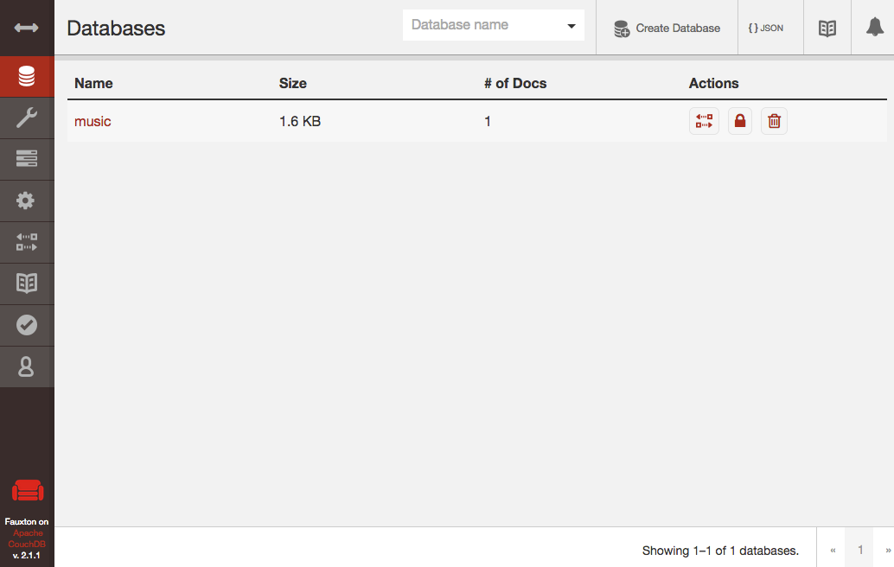

# couchdb-docker

## CouchDBとは

_CouchDBは、堅牢で安定したNoSQLデータベースである ― 7つのデータベース 7つの世界_

##  概要

CouchDBを試せるdocker環境



## 起動

コンテナを起動する

```bash
docker-compose up -d
```

Futonを開く

http://localhost:5984/_utils/

その後の動作手順は[こちら](src/doc/README.md)を参照
